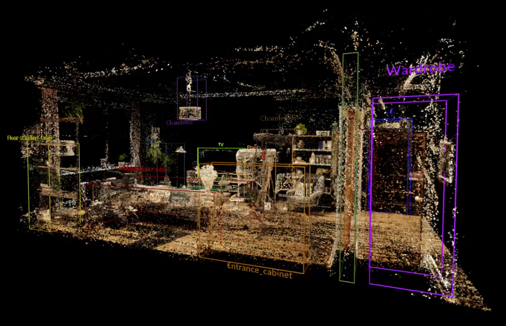

# SpatialLM Point Cloud Classifier/Segmentation 

This repository contains scripts for processing and classifying 3D point clouds using SpatialLM, a Large Language Model-based approach for 3D scene understanding. That has been adapted for point cloud segmentation. 

## Method Overview

SpatialLM utilizes large language models to analyze and understand 3D point cloud data. Unlike traditional classification methods that require extensive training on specific object instances, SpatialLM understands objects conceptually. This allows it to recognize different variations of objects (like various chair designs) without needing to be trained on each instance.

The workflow is divided into two complementary scripts that perform different stages of the processing pipeline:

## Scripts

### 1. spatialLM_predictions_Bounding_box_creator.ipynb
**Run this script FIRST**

This script handles the initial processing of point cloud data and object detection:
- Loads the point cloud data (.ply files)
- Processes the point cloud through the SpatialLM model
- Generates predictions for objects in the scene
- Creates bounding boxes around detected objects
- Exports prediction data to a text file in the format:
 - bbox_0=Bbox(label,x,y,z,rotation,dx,dy,dz)
 
Parameters explained:
- label: Object category (chair, sofa, table, etc.)
- x,y,z: Center coordinates of the bounding box
- rotation: Rotation around the vertical axis
- dx,dy,dz: Dimensions of the bounding box

Key features of the first script:
- Utilizes undocumented parameters discovered during research to improve detection quality
- Includes visualization tools to confirm correct bounding box placement

### 2. Export_Classified_pointcloud_SpatialLM.ipynb
**Run this script SECOND**

This script converts the bounding box text file into classified point clouds:
- Reads the bounding box definitions from the text file generated by the first script
- Loads the original point cloud data
- Uses Open3D's `get_point_indices_within_bounding_box` function to identify which points fall within each bounding box
- Assigns classification attributes to points based on their containing bounding box
- Creates a new point cloud with classification attributes
- Exports the classified point cloud as a PLY file for visualisation or further processing 
- Supports filtering and segmentation by object class

## Parameters

The SpatialLM prediction can be adjusted using several parameters:
- `num_beams`: Controls how many prediction paths are explored (higher values = more thorough but slower)
- `top_k`: Number of most likely predictions to consider at each step
- `temperature`: Controls randomness in predictions (lower = more conservative)

## Sample Data

A sample model is located at: `pcd/scene0061_00.ply` from Manycore.

## Important Notes

- **Orientation Requirements**: The orientation of input point clouds is critical for accurate results. Your point clouds must match the orientation of example files provided in the SpatialLM repository. This typically means:
 - Up direction should be along the Z-axis
 - Floor should be parallel to the XY plane
 - Room layout should match the examples provided by SpatialLM (typically with walls parallel to X and Y axes) See example data
- SpatialLM-Qwen-0.5B generally performs better for furniture recognition
- SpatialLM-Llama-1B performs better on architectural elements
- Results may vary between runs due to the stochastic nature of the prediction process
- Processing a typical room scene requires approximately 12-15GB of VRAM with default settings

## Demo

click image to view video

##Acknowledgments

Based on SpatialLM GitHub repository
https://github.com/manycore-research/SpatialLM

Thanks to VisualSkies for providing test data

## Test dataset
https://drive.google.com/file/d/1gqn8mt2rC6o_Z3PVH7jODeeQrg_svDec/view?usp=sharing
