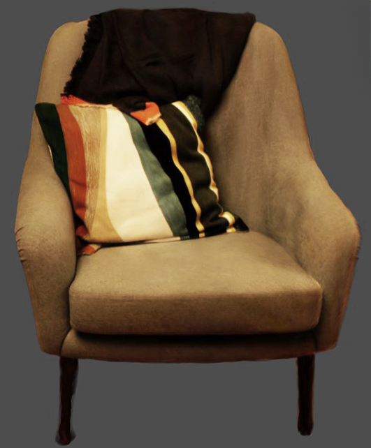

# SAM2 Video Segmentation for Gaussian Splats

This branch implements segmentation using Meta's SAM2 Video model to create masks for Gaussian splat source images. It also has specialised export functionality for Postshot.

## Overview

SAM2 Video enables the segmentation of image sequences by propagating selections across frames while allowing for interactive refinement. This approach is particularly effective for creating masks with complex boundaries and handling occlusion.

## Key Features

- **Interactive Refinement**: Correct specific frames where segmentation fails
- **High-Resolution Support**: Works well with 6000×9000px images
- **Object Consistency**: Rarely confuses unrelated objects or selects them randomly
- **Occlusion Handling**: Effectively tracks objects that are partially visible or cut off
- **Multi-Object Support**: Multiple object selections can be combined into a binary mask
  
## Dataset:
https://storage.googleapis.com/anmstorage/Master_class/Chair_splat_dataset.zip

## Sam2Video Example results:

Video example (click on image to view results)

## Custom mask export script designed for PostShot:

1. Automatically creates versioned output directories (v001, v002, etc.)
2. Combines multiple object masks into a single binary mask
   - WHITE (255) = Subject
   - BLACK (0) = Background
3. Adds the binary mask as an alpha channel to the original image
   - Preserves full RGB data
   - No premultiplication
   - No actual transparency applied
4. Exports as PNG files containing original image with mask as alpha channel
   (Alpha is not premultiplied or set for transparency)

  ## POSTSHOT Results 

  
  
3DGS created from matted sam2video image sequences using Postshot. 
